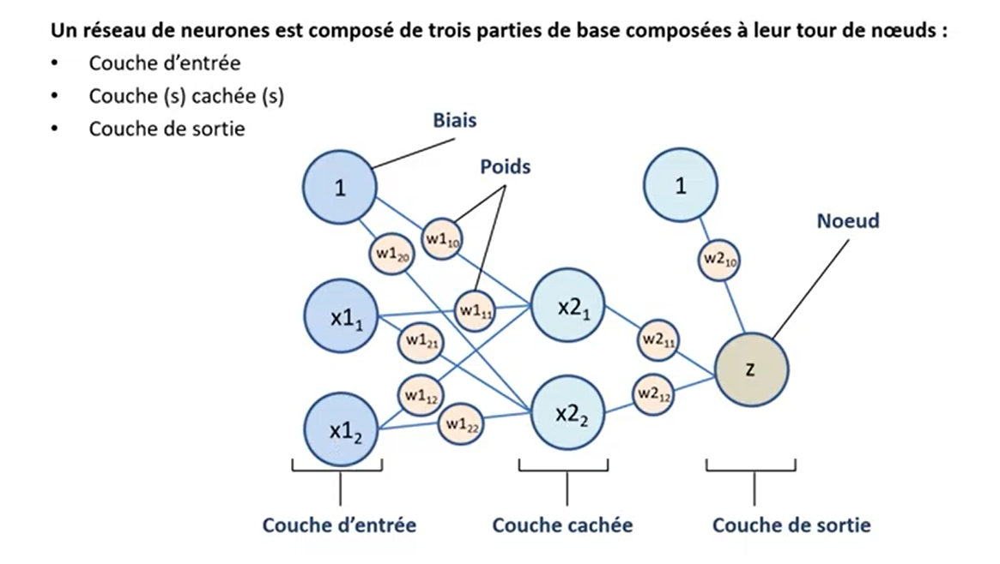

# reseau-neurone-tensorflow-2
TensorFlow est une bibliothèque open source de Machine Learning, créée par Google, permettant de développer et d’exécuter des applications de Machine Learning et de Deep Learning
## Réseau de neurones avec Tensorflow 2

## Intelligence Artificielle

## Exemple introductif: Perceptron

## Exemple avec seul neurone
Un seul neurone ne peut modeliser que les phenomènes lineairement separables

## Réseau de neurones

## Architecture de réseaux de neurones

