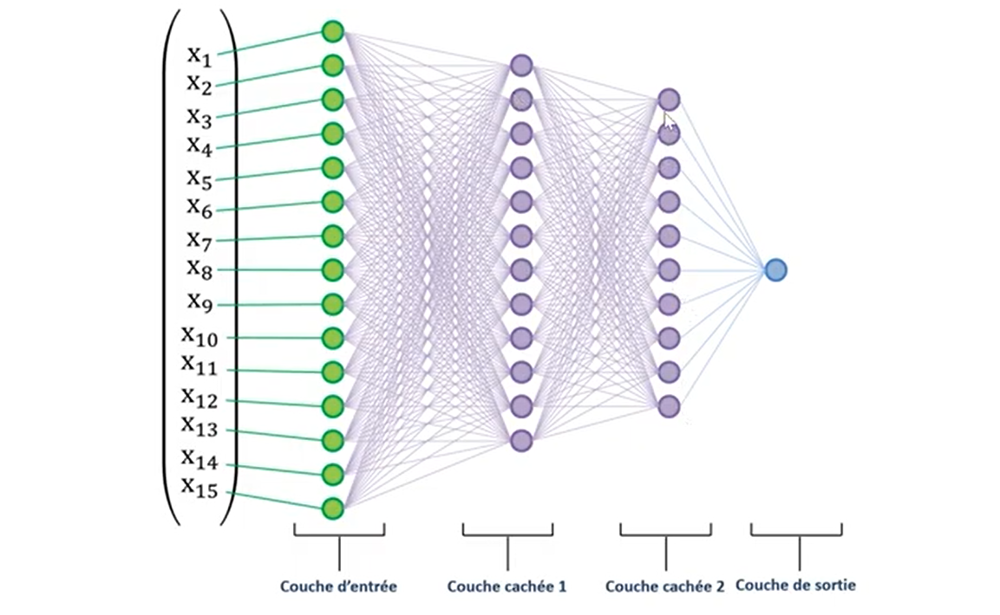

# reseau-neurone-tensorflow-2
TensorFlow est une bibliothèque open source de Machine Learning, créée par Google, permettant de développer et d’exécuter des applications de Machine Learning et de Deep Learning
## Réseau de neurones avec Tensorflow 2

## Intelligence Artificielle

## Exemple introductif: Perceptron

## Exemple avec seul neurone
Un seul neurone ne peut modeliser que les phenomènes lineairement separables

## Réseau de neurones

## Architecture de réseaux de neurones

## Differents types de couches d'un réseau de neurone

## Anaconda

## Anaconda Navigator

## Spyder

## Pourquoi Tensorflow 2.0 ?

## Tnesorflow 2.0 and Keras

## Résumé du modèle Tensorflow 2

## Detail de la création du modèl
## Charger le jeu de données

## Réseau de neurones avec TF2.Keras

## Definir le modèle de réseau de neurones

